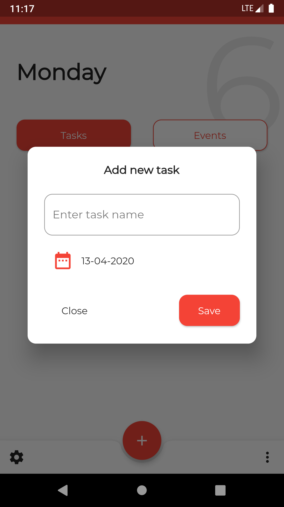
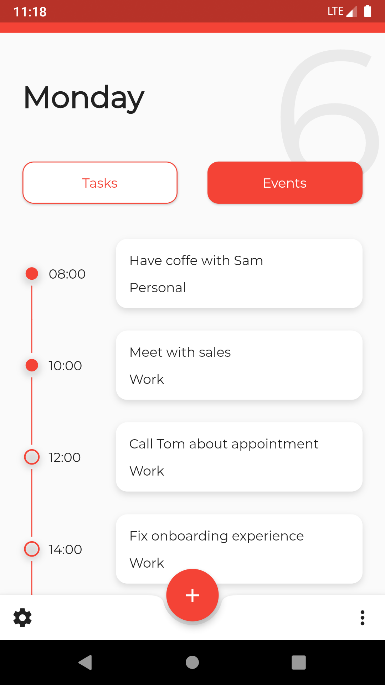
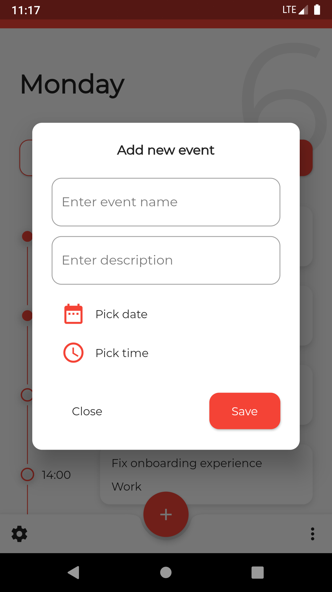

# To-do List App 👋

# Flutter Version
Flutter 1.22.3

# Screenshots

||||
|--|--|--|
|  |  | |
|  |  | |

# Command
### Install dependencies

```sh
flutter pub get
```

### Run application

```sh
flutter emulators --launch <emulator_name>
flutter run
```

### Generate MOOR

```sh
flutter packages pub run build_runner build
```

### Build

```sh
flutter build apk
```

### Run tests

```sh
flutter test
```


# Plugins

- [moor](https://pub.dev/packages/moor) ^3.4.0
- [sqlite3_flutter_libs](https://pub.dev/packages/sqlite3_flutter_libs) ^0.2.0
- [path_provider](https://pub.dev/packages/path_provider) ^1.6.24
- [path](https://pub.dev/packages/path) ^1.7.0
- [intl](https://pub.dev/packages/intl) ^0.16.1
- [provider](https://pub.dev/packages/provider) ^4.3.2+2
